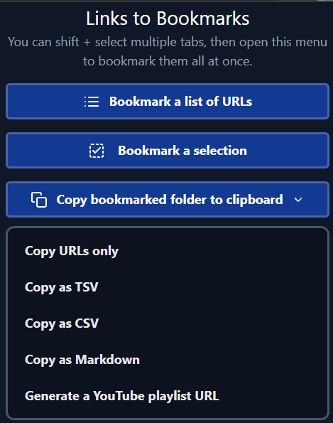
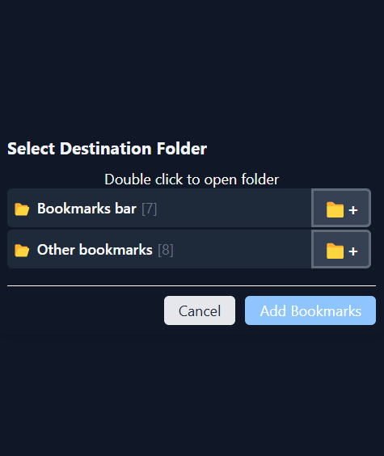
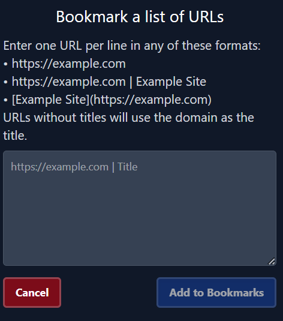

TODO:
remove duplicates broken
file import support other formats
todo current tabs to csv

About
-----------------------------
Chrome extension to help bookmark links.

Click the extension icon to use.

Features:
-----------------------------
- Import a list of links (bar or tab separated or markdown or plain) (folder selection & creation)
- Add the selected tabs to bookmarks
- Selection tool to bookmark links on a page (with confirmation and folder selection)
- Export a folder to a list of links (plain, tsv, csv, markdown)
- Generate a youtube playlist from a folder
- Dark/light mode (uses system setting)

Compiling
-----------------------------
1. Install dependencies (if you haven't already):
```
npm install
```

2. Build the extension:
```
npm run build
```
This will create a dist directory with your built extension. In developer mode, you can load unpacked extension into chrome/edge (or any chrome based forks)

4. To package as a zip (windows)
```
cd dist
powershell Compress-Archive -Path * -DestinationPath ../links2bookmark.zip
```

4. Alternatively, using WXT CLI
```
npx wxt build --zip
```

Pics:
-----------------------------


-----------------------------



-----------------------------



Potential New Features: (soon):
-----------------------------
2.  **Recently added filter** - Quick filter to show only recently added bookmarks
3.  **JSON syntax for bookmarks** - probably just use the html syntax but with json instead of xml
4. Custom bookmarks page: Modify the bookmarks page to allow directly right click copying links

(later):
-----------------------------
1.  **Pagination (Next/Previous)** - Show next/previous button on pages that are bookmarked to go to the next page in the same bookmark folder (with shortcut). implementation should check history to determine what folder is applicable
2.  **Statistics view** - Show simple statistics about your bookmarks (total count, by domain, etc.)
3.  **Keyboard shortcuts** - for some basic actions

(laterer (hey, thats not a word)):
-----------------------------

1.  **Reading list mode** -  Add a special folder that acts as a reading list with a "mark as read" option (idk)
2.  **Quick tags** - Add tag system (for the json export/import) that can be searched and easily added to bookmarks

(last):
-----------------------------------------------

1.  **Favicon importing** - option to fetch icons for bookmarks in the background
2.  **Browser history integration** - display last visited next to the bookmarks in view, and option to import links from history
